<p align="center">
  
</p>

<p align="center">
  
</p>

<p align="center">
  <b>A little pixel-art crab who lives above your prompt in Claude Code.</b><br>
  He reacts to what Claude is doing, shows your usage, and dresses up for holidays, your days, the weather and the sky.
</p>

<p align="center">
  <a href="https://danielmejia.dev/projects/clawd-walker"><b>▶ Try him live in your browser</b></a>
  &nbsp;·&nbsp;
  <a href="#install">Install</a>
  &nbsp;·&nbsp;
  <a href="#set-him-up">Set him up</a>
  &nbsp;·&nbsp;
  <a href="https://ko-fi.com/cursedchair">Buy me a coffee</a>
</p>

<p align="center">
  
  
  
  
  
</p>

> **Unofficial fan project.** Krab Koder is not made by, endorsed by or affiliated with Anthropic. Clawd, Claude and the Claude logo belong to Anthropic. Other characters and names that appear in outfits belong to their owners.

---

## 🦀 He reacts to Claude's work

146 reactions in all, from the tools and apps Claude uses (web searches, builds, deploys, databases, Blender, Unity and more) to what you write ("gm", "lol", 🔥) and the time of the week. These are the ones you'll see every day:

<table>
  <tr>
    <td align="center">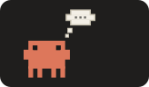<br><b>Thinking</b><br><sub>dots while Claude works</sub></td>
    <td align="center"><br><b>Writing a file</b><br><sub>scribbling on a notepad</sub></td>
    <td align="center"><br><b>Running a command</b><br><sub>typing at the terminal</sub></td>
  </tr>
  <tr>
    <td align="center"><br><b>Reading</b><br><sub>nose in a book</sub></td>
    <td align="center"><br><b>Reply ready</b><br><sub>a wave when Claude finishes</sub></td>
    <td align="center">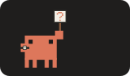<br><b>Waiting for permission</b><br><sub>holds up a "?" until you answer</sub></td>
  </tr>
  <tr>
    <td align="center">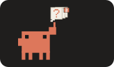<br><b>Claude asks you questions</b><br><sub>a bubble with how many</sub></td>
    <td align="center"><br><b>A command failed</b><br><sub>a puff of smoke</sub></td>
    <td align="center"><br><b>Context filling up</b><br><sub>he gets tired and sweaty</sub></td>
  </tr>
  <tr>
    <td align="center"><br><b>Tests pass</b><br><sub>fists up, confetti down</sub></td>
    <td align="center"><br><b>Tests fail</b><br><sub>a facepalm</sub></td>
    <td align="center">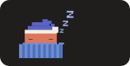<br><b>Quiet for a minute</b><br><sub>tucked into bed</sub></td>
  </tr>
</table>

He also shows your **context, 5-hour and weekly limits and cost** as little pills, gets tired as the context fills up, and checks his watch when a limit is close.

## ✨ Showstoppers

His most elaborate routines, and the ones you won't find anywhere else.

<table>
  <tr>
    <td align="center">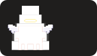<br><b>Switching up to Fable</b><br><sub>wings, a halo, and he ascends</sub></td>
    <td align="center">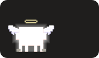<br><b>Switching down from Fable</b><br><sub>the glow flickers out and he drops</sub></td>
    <td align="center">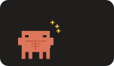<br><b>Switching to Opus</b><br><sub>he bulks up and flexes</sub></td>
  </tr>
  <tr>
    <td align="center"><br><b>Switching to Sonnet</b><br><sub>he shrinks into a pair of glasses</sub></td>
    <td align="center">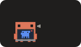<br><b>Sessions talking</b><br><sub>a video call with another session</sub></td>
    <td align="center"><br><b>Helper agents</b><br><sub>a little crab in a hard hat for each</sub></td>
  </tr>
  <tr>
    <td align="center"><br><b>Compacting the chat</b><br><sub>he crumples it into a ball</sub></td>
    <td align="center"><br><b>A limit runs out</b><br><sub>out cold until it resets</sub></td>
    <td align="center"><br><b>A limit resets</b><br><sub>he waves the flag</sub></td>
  </tr>
  <tr>
    <td align="center">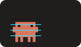<br><b>A reply fails</b><br><sub>he glitches out</sub></td>
    <td align="center">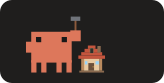<br><b>A new worktree</b><br><sub>he builds a little house</sub></td>
    <td align="center">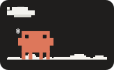<br><b>First snow of the season</b><br><sub>from your live weather, once a year</sub></td>
  </tr>
  <tr>
    <td align="center"><br><b>A rare visitor</b><br><sub>about one night in 40</sub></td>
    <td align="center"><br><b>Solar eclipse</b><br><sub>the moon slides over the sun</sub></td>
    <td align="center"><br><b>Blood moon</b><br><sub>the earth's shadow turns it red</sub></td>
  </tr>
</table>

## 🎃 He dresses for the day

Around 80 outfits for holidays around the world, plus your birthday, a partner's birthday and your anniversary once you set them.

<table>
  <tr>
    <td align="center"><br><b>Christmas</b><br><sub>handing you a present</sub></td>
    <td align="center"><br><b>Halloween week</b><br><sub>a new costume every day</sub></td>
    <td align="center"><br><b>Lunar New Year</b><br><sub>lanterns and fireworks</sub></td>
  </tr>
  <tr>
    <td align="center"><br><b>Diwali</b><br><sub>diyas and fireworks</sub></td>
    <td align="center">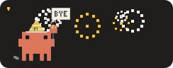<br><b>New Year's Eve</b><br><sub>waving goodbye to the old year</sub></td>
    <td align="center"><br><b>Fourth of July</b><br><sub>stars, stripes and fireworks</sub></td>
  </tr>
  <tr>
    <td align="center"><br><b>Canada Day</b><br><sub>pumping iron for the country</sub></td>
    <td align="center"><br><b>Summer</b><br><sub>a straw hat and shades</sub></td>
    <td align="center"><br><b>Pi Day</b><br><sub>March 14, digits of pi drifting by</sub></td>
  </tr>
</table>

## 🌟 Rare and unusual outfits

Some only come around once a year, some once every four years, and one only for a single hour.

<table>
  <tr>
    <td align="center">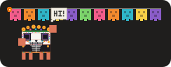<br><b>Day of the Dead</b><br><sub>papel picado and marigolds</sub></td>
    <td align="center">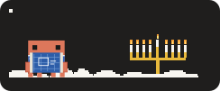<br><b>Hanukkah</b><br><sub>one more candle lit each night</sub></td>
    <td align="center">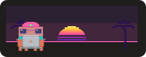<br><b>Neon City Launch Day</b><br><sub>searching the web under a neon sunset</sub></td>
  </tr>
  <tr>
    <td align="center"><br><b>Cyber Monday</b><br><sub>raining ones and zeros</sub></td>
    <td align="center">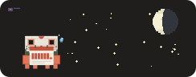<br><b>Friday the 13th</b><br><sub>beats every other outfit</sub></td>
    <td align="center">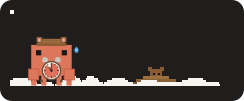<br><b>Groundhog Day</b><br><sub>stuck on the clock again</sub></td>
  </tr>
  <tr>
    <td align="center">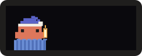<br><b>Earth Hour</b><br><sub>only from 8:30 to 9:30 pm</sub></td>
    <td align="center"><br><b>Leap Day</b><br><sub>once every four years</sub></td>
    <td align="center">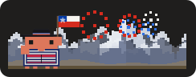<br><b>Chile's Independence Day</b><br><sub>the Andes, a huaso hat and the flag</sub></td>
  </tr>
</table>

## 🌦️ He follows your weather and sky

Live weather once you set your location, the real moon phase, eclipses, meteor showers and the northern lights.

<table>
  <tr>
    <td align="center">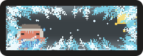<br><b>Extreme cold</b><br><sub>behind a frozen window</sub></td>
    <td align="center">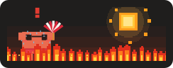<br><b>Heat wave</b><br><sub>flames and melting pills</sub></td>
    <td align="center"><br><b>Storms</b><br><sub>rain, hail and lightning</sub></td>
  </tr>
  <tr>
    <td align="center">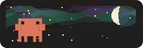<br><b>Northern lights</b><br><sub>when the real aurora is out</sub></td>
  </tr>
</table>

---

## Install

You need Claude Code with plugin support. In a terminal:

```bash
claude plugin marketplace add CursedChair/krab-koder
```

```bash
claude plugin install krab-koder@krab-koder
```

Restart Claude Code and he appears above the prompt, saying hello.

## Set him up

Out of the box he shows worldwide holidays and no weather. A few commands make him yours (type them in Claude Code):

```text
/krab location Toronto        your weather and seasons (or type "latitude, longitude")
/krab holidays CA US          your countries' holidays (CA-ON for a province, and so on)
/krab birthday Jan 15         your birthday (also gf-birthday, bf-birthday, anniversary)
/krab settings                see what's set, and what's left to set
```

<details>
<summary><b>All commands</b></summary>

| Command | What it does |
| --- | --- |
| `/krab settings` | Show your current settings and what's left to set |
| `/krab location <city>` | Use your local weather and time of year (or type `latitude, longitude`) |
| `/krab holidays <codes>` | Which holidays to follow, such as `CA`, `US`, `MX`, `GB` or `CA-ON` for a province |
| `/krab birthday <date>` | Your birthday, such as `Jan 15` |
| `/krab gf-birthday`, `bf-birthday`, `anniversary <date>` | Other days that matter to you |
| `/krab on`, `off` | Show or hide him |
| `/krab small`, `normal`, `big` | Change his size |
| `/krab outfit auto`, `off` or a name | Follow the date, take the outfit off, or try one |
| `/krab weather auto`, `off` or a kind | Use live weather, turn it off, or try one like `snow` or `heat` |
| `/krab sky auto` or an event | Follow the real sky, or try `aurora`, `meteors`, `bloodmoon`, `ufo`, `comet` or `eclipse` |
| `/krab time auto` or a time | Follow the clock, or try `night`, `sunrise`, `sunset` or `day` |

</details>

## Privacy

- **Nothing about you is sent to me.** There are no accounts, no analytics and no tracking.
- **Your settings stay on your computer,** in Claude Code's own plugin storage: your days, location and holidays.
- **Live weather** is fetched from [Open-Meteo](https://open-meteo.com) every 15 minutes (forecast and air quality). They receive your saved coordinates and, like any website, your internet address. When you set your location by name, the name you type is sent to Open-Meteo's city search.
- **The northern lights** check [NOAA's space weather feed](https://www.swpc.noaa.gov). They receive nothing about you beyond your internet address.
- Nothing is fetched at all until you set a location with `/krab location`, and `/krab weather off` stops all of it.

## Support

Krab Koder is free. If he makes your day a little better, you can [buy me a coffee on Ko-fi](https://ko-fi.com/cursedchair) ☕

## Contact

Found a bug, have an idea, or own something that appears here and want it changed? [Open an issue](https://github.com/CursedChair/krab-koder/issues). For security problems, see [SECURITY.md](SECURITY.md).

## Development

Plain JavaScript with no dependencies. Run the tests with:

```bash
node --test tests/*.test.mjs
```

## License

[MIT](LICENSE) for the code. The license covers my own work only. It grants no rights to Anthropic's Clawd character, the Claude name or logo, or any other company's characters or trademarks.
